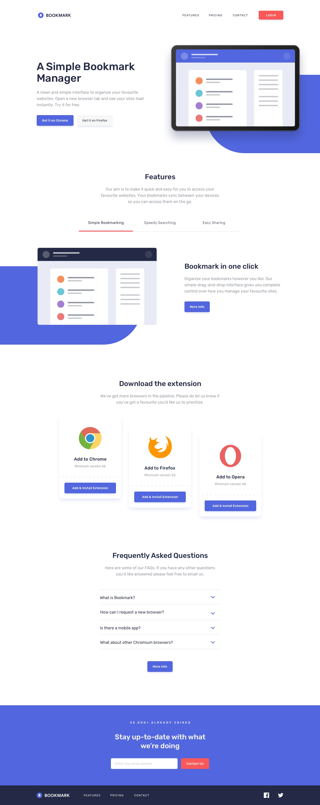
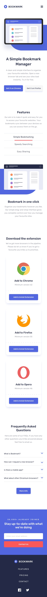

# Bookmark Landing Page

A responsive landing page for a browser bookmark manager extension, built with pure HTML, CSS (inline + media queries), and vanilla JavaScript.

## Preview

| Desktop | Mobile |
|--------|--------|
|  |  |

## Features

- **Responsive layout** — uses `flex-wrap` and a media query (`max-width: 768px`) to stack content vertically on mobile
- **Navbar** — logo, nav links, and a LOGIN button; nav links hidden on mobile
- **Hero section** — headline, description, and CTA buttons alongside an illustration
- **Features tabs** — three switchable tabs (Simple Bookmarking, Speedy Searching, Easy Sharing) each showing a relevant illustration and description
- **Browser extension cards** — Chrome, Firefox, and Opera download cards
- **FAQ accordion** — four expandable questions with animated arrow icons
- **Contact / newsletter section** — email input with inline validation and error state
- **Footer** — dark background with nav links and social icons (Facebook, Twitter)

## File Structure

```
task4/
├── task4.html                     # Main HTML file
├── README.md                      # This file
├── logo-bookmark.svg
├── logo-chrome.svg
├── logo-firefox.svg
├── logo-opera.svg
├── illustration-features-tab-1.svg
├── illustration-features-tab-2.svg
├── illustration-features-tab-3.svg
├── icon-facebook.svg
├── icon-twitter.svg
├── icon-hamburger.svg
├── icon-close.svg
├── icon-arrow.svg
├── icon-error.svg
├── bg-dots.svg
└── favicon-32x32.png
```

## How to Run

Just open `task4.html` in any modern browser — no build tools or dependencies required.

## Responsive Behavior

| Screen | Behavior |
|--------|----------|
| Desktop (> 768px) | Side-by-side flex layout for hero, tabs, and cards |
| Mobile (≤ 768px) | All sections stack vertically; nav links hidden |

## Technologies Used

- HTML5
- CSS3 (inline styles + `@media` query)
- Vanilla JavaScript (tab switching, FAQ accordion, email validation)
